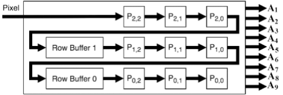
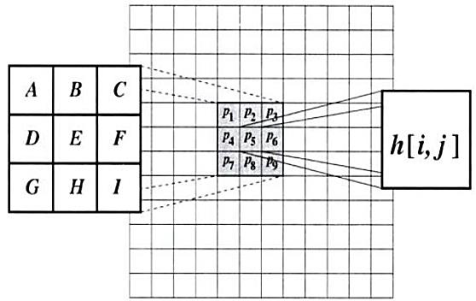
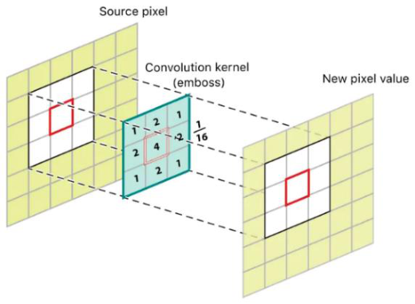
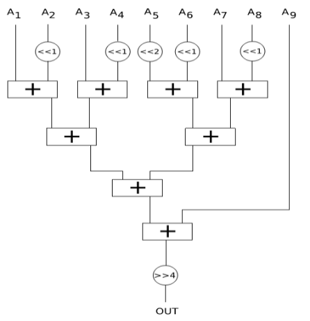
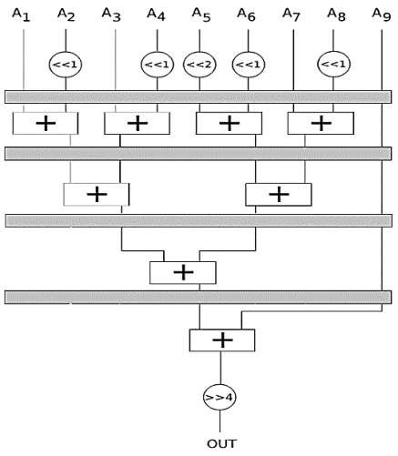
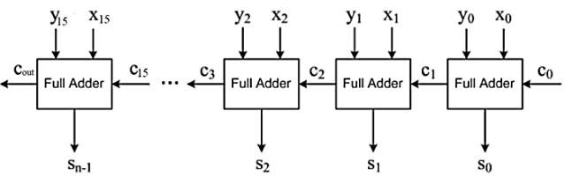
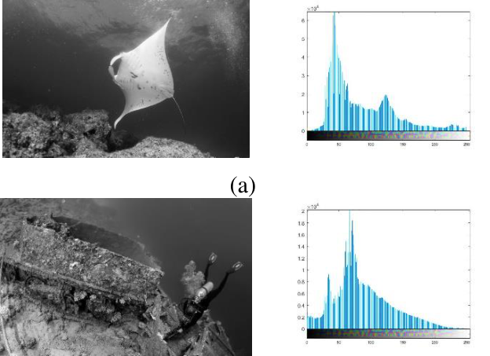
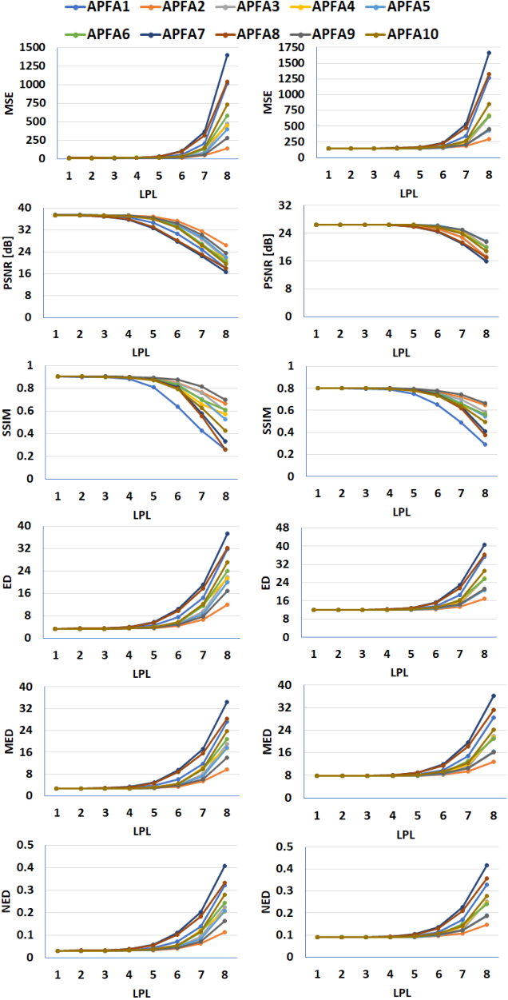
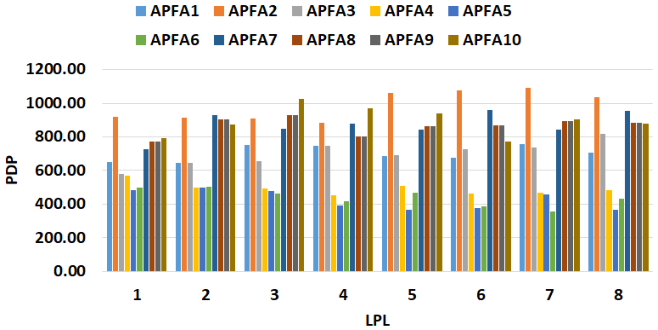

# Summary of Research Paper

**Underwater Image Enhancement Using FPGA-Based Gaussian Filters with Approximation Techniques**  
*Summary Date: August 2, 2025*

1. **Introduction / Abstract**  
The paper addresses the problem of poor visual quality in underwater images caused by natural effects like light absorption and scattering, which create haziness and noise. To improve these images, the authors propose an efficient method using a **Gaussian filter** (a mathematical tool for smoothing images and reducing noise) implemented on a **Field-Programmable Gate Array (FPGA)** (a type of reconfigurable hardware device). The key innovation is a pipeline architecture combined with approximate adders (simplified arithmetic units that trade some accuracy for better speed and lower power use). The main findings show that this approach speeds up processing by over 150% and reduces power consumption by more than 34%, though it requires more hardware area. This tradeoff is suitable for error-tolerant applications like image and video processing.

2. **Methodology**  
The researchers designed a pipeline Gaussian filter architecture on an FPGA platform. The pipeline divides the filtering process into stages that operate simultaneously, increasing speed. They used line buffers and window buffers to efficiently handle image data in real time. To further improve efficiency, they incorporated various types of approximate adders that simplify addition operations by allowing small errors, reducing logic complexity and power use. They tested ten different approximate adder designs, applying approximations to the least significant bits of 16-bit adders. The system was simulated in MATLAB with real underwater images corrupted by Gaussian noise, and then synthesized on an Intel MAX10 FPGA device to measure power, speed, and area.

3. **Theory / Mathematics**  
The Gaussian filter is based on the two-dimensional Gaussian function:  
\[
f(x,y) = \frac{1}{2\pi\sigma^2} e^{-\frac{x^2 + y^2}{2\sigma^2}}
\]  
where \(f(x,y)\) is the filter value at coordinates \((x,y)\), and \(\sigma\) is the standard deviation controlling the spread of the filter. This function smooths images by emphasizing central pixels and reducing the influence of distant pixels, effectively reducing noise. The filter is separable, meaning a 2D filter can be applied as two 1D filters sequentially, improving computational efficiency.

The convolution operation for filtering is expressed as:  
\[
h[i,j] = A P_1 + B P_2 + C P_3 + D P_4 + E P_5 + F P_6 + G P_7 + H P_8 + I P_9
\]  
where \(P_1\) to \(P_9\) are pixel values in a 3x3 window, and \(A\) to \(I\) are corresponding weights from the Gaussian kernel.

Image quality was quantitatively assessed using:  
- **Peak Signal-to-Noise Ratio (PSNR):**  
\[
PSNR(f,g) = 20 \log_{10} \left(\frac{2^B - 1}{\sqrt{MSE(f,g)}}\right)
\]  
where \(B\) is bit depth, and \(MSE\) is Mean Square Error.  
- **Mean Square Error (MSE):**  
\[
MSE(f,g) = \frac{1}{MN} \sum_{i=1}^M \sum_{j=1}^N (f_{ij} - g_{ij})^2
\]  
- **Structural Similarity Index (SSIM):** A measure considering luminance, contrast, and structure similarity between images.  
- **Error Distance (ED), Mean Error Distance (MED), Normalized Error Distance (NED):** Metrics measuring spatial differences between original and processed images.

4. **Key Diagrams or Visual Elements**  

- **Figure 1:** Shows the delay line buffer structure used to store recent pixel values, minimizing memory access during convolution. This buffer holds the current 3x3 pixel window and two previous rows, enabling efficient filtering.  

- **Figure 2:** Illustrates the convolution operation applying the 3x3 Gaussian kernel over the image pixels to compute the filtered output.  

- **Figure 3:** Depicts the weighted Gaussian kernel used in the filter, showing the relative importance of each pixel in the 3x3 window.  

- **Figure 4:** Block diagram of the Gaussian filter implementation, highlighting the use of adders and shifters for multiplication and division operations via bit shifts.  

- **Figure 5:** Pipeline structure of the Gaussian filter, dividing the computation into four stages to increase throughput.  

- **Figure 6:** Diagram of the 16-bit carry ripple adder used in the approximate adder designs, showing how approximation is applied to least significant bits.  

- **Figure 7:** Two sample raw underwater images (a flatfish and a diver) with their histograms, used for simulation testing.  

- **Figure 8:** Graphs showing image quality metrics (PSNR, SSIM, etc.) for different approximate adder configurations, indicating that up to 5-bit approximation maintains good quality.  

- **Figure 9:** Power-Delay Product (PDP) comparison for different approximate adders, identifying APFA4, APFA5, and APFA6 as most power-efficient and fast.

5. **Conclusion**  
The study successfully demonstrates that implementing a pipeline Gaussian filter with approximate adders on FPGA significantly improves processing speed (over 150%) and reduces power consumption (over 34%) for underwater image enhancement. Although this comes with increased hardware area, the tradeoff is justified in error-resilient applications like image and video processing where slight accuracy loss is acceptable. This work advances underwater imaging by providing a practical, hardware-efficient solution to improve image quality in challenging marine environments, enabling better monitoring and analysis of underwater scenes.

**Why It Matters:**  
Improving underwater image quality is vital for marine research, environmental monitoring, and underwater robotics. This research offers a fast, low-power hardware method to enhance images in real time, facilitating more effective exploration and management of underwater ecosystems.